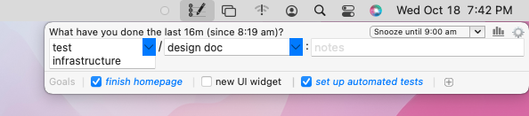

# whatdid

Download Whatdid [here][download]!

[download]: https://whatdid.yuvalshavit.com/Whatdid.dmg

---

## "What did I do all day?"

If you're like me, there are days you feel like you've worked and worked, and when the end of the day rolls around you
wonder where the time went. "***What*** ***d***id ***I*** ***d***o all day?" _whatdid_ is a simple tool designed to help
answer that question.

Every ten minutes or so (configurable), you'll get a little popup at the top-right of your screen, like so:

  
Just enter what you've been working on since the last time it asked you, and that's it.

At the end of the day, _whatdid_ will tell you what you worked on:

## Where to get it

For source code and the latest binaries: [github.com/yshavit/whatdid](https://github.com/yshavit/whatdid/)
